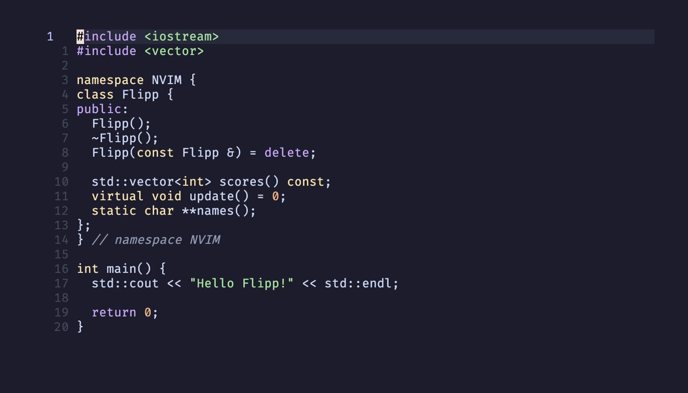

**flipp.nvim** provides smart C++ function and method definition generation from declarations

[Features](#-features ) • [Requirements](#-requirements) • [Installation](#-installation)



# ✨ Features 

* Generate signatures for definitions of function and method declarations
* Detect declarations that already have definitions and filter from being generated
* Open peek window to source file to quickly implement definitions

# 📋 Requirements 

* Neovim >= **v0.5.0**
    * Treesitter C++ parser
* clangd >= **v9.0.0**

# 📦 Installation

### [lazy.nvim](https://github.com/folke/lazy.nvim)

```lua
{
    "willtrojniak/flipp.nvim",
    version = "*",

    ---@module 'flipp'
    ---@type flipp.Opts
    opts = {
      register = "f", -- The register to save definitions to
      lsp_name = "clangd", -- The name of the lsp to use
      peek = false, -- Whether or not to open floating window to source file
      namespaces = false, -- Whether or not to include namespaces in generated defs
      win = function(curr_win) -- Window config for peeking 
        local curr_height = vim.api.nvim_win_get_height(curr_win)
        local curr_width = vim.api.nvim_win_get_width(curr_win)

        ---@type vim.api.keyset.win_config
        return {
          relative = 'win',
          row = math.ceil(curr_height / 4),
          col = 0,
          height = math.ceil(curr_height / 2),
          width = curr_width,
        }
      end
    }
}

```
